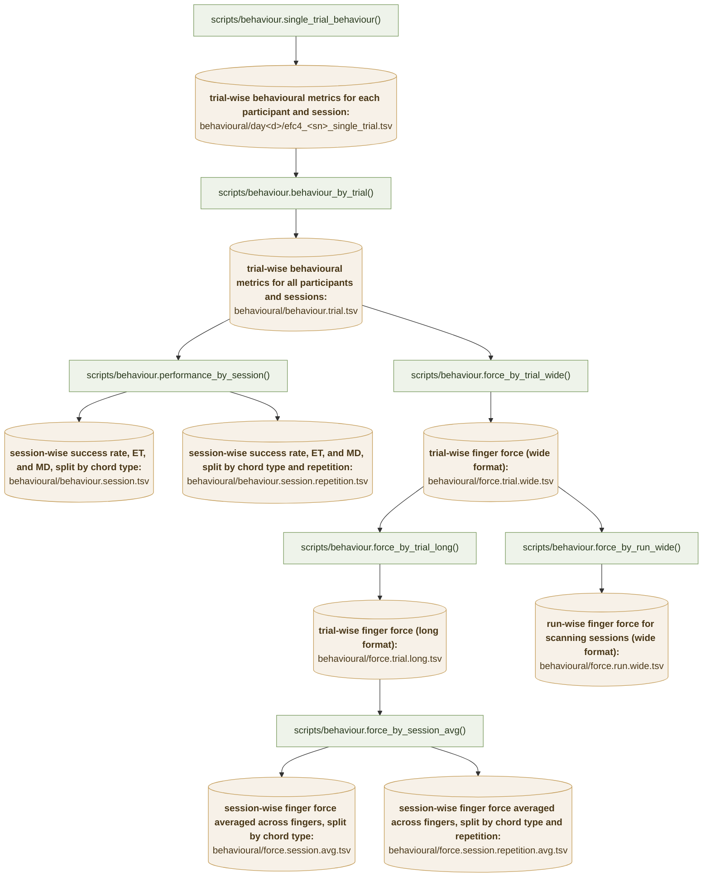

# EFC_learningfMRI

Analysis code for the extension–flexion chord (EFC) learning fMRI study: participants
practise a set of finger chords over 24 days, with fMRI scans on days 3, 9 and 23.

## Experimental design

* 8 chords (`gl.chordID`), 4 assigned as **trained** and 4 as **untrained** per
  participant (`participants.tsv`, columns `trained` / `untrained`).
* 24 days (`behavioural/day1` … `behavioural/day24`); each day is associated to a `session_type`:
  `pretraining` (days 1-2), `scanning` (days 3, 9, 23), `testing` (days 4, 10, 24) or `training` (all other sessions).
* Each trial the participant produces one 4-finger chord; force is sampled at
  500 Hz (`gl.fsample['force']`) and each chord is repeated twice in a row
  (`Repetition` 1 vs 2).

## Behavioural data flow

Green = code, amber = saved tables; each green node is the function that writes the tables it
points to. Every step reloads its input from disk, so the arrows are also the order the steps
have to be run in. All paths are relative to `gl.baseDir`; `<sn>` is the participant number,
`<bl>` the block number and `<d>` the day.

