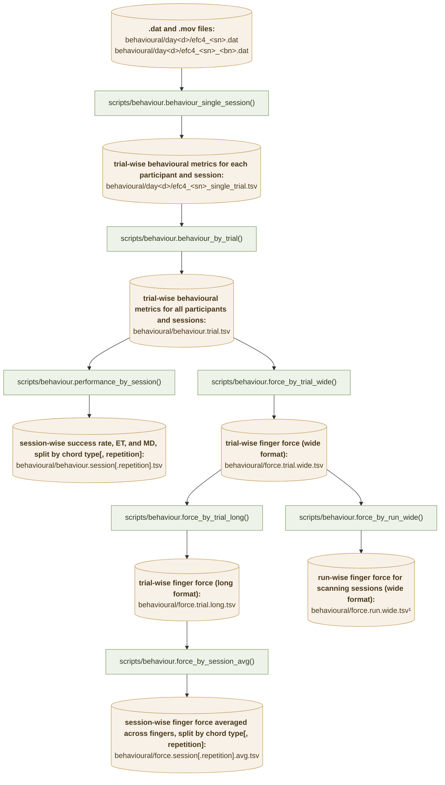
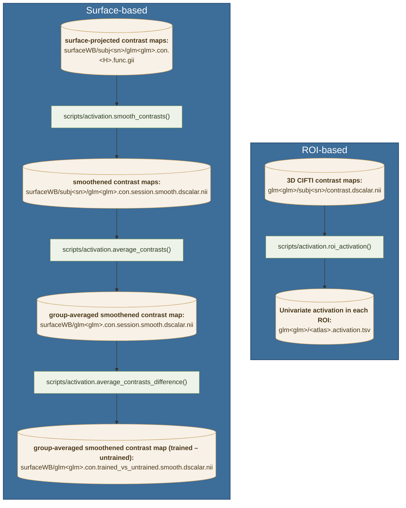
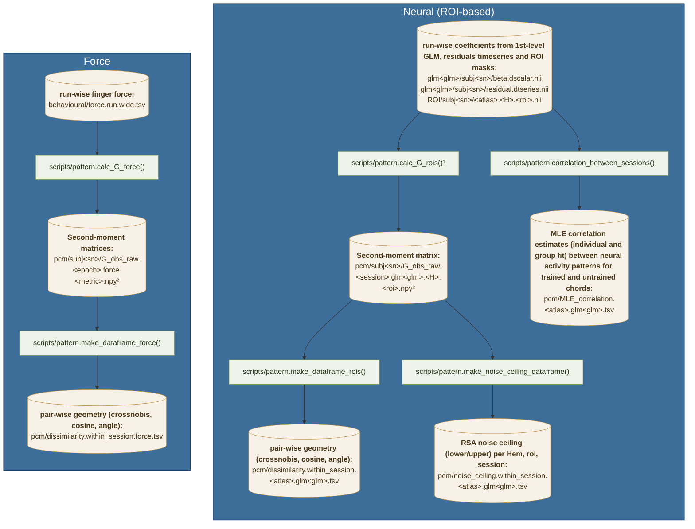

# EFC_learningfMRI

Analysis code for the extension–flexion chord (EFC) learning fMRI study: participants
practise a set of finger chords over 24 days, with fMRI scans on days 3, 9 and 23.

## Experimental design

* 8 chords (`gl.chordID`), 4 assigned as **trained** and 4 as **untrained** per
  participant (`participants.tsv`, columns `trained` / `untrained`).
* 24 days (`behavioural/day1` … `behavioural/day24`); each day is associated to a `session_type`:
  `pretraining` (days 1-2), `scanning` (days 3, 9, 23), `testing` (days 4, 10, 24) or `training` (all other sessions).
* Each trial the participant produces one 4-finger chord; force is sampled at
  500 Hz (`gl.fsample['force']`) and each chord is repeated twice in a row
  (`Repetition` 1 vs 2).

## Dataflows
### Behaviour

¹Used for pattern analysis (see below)

<!-- Green = code, amber = saved tables; each green node is the function that writes the tables it
points to. Every step reloads its input from disk, so the arrows are also the order the steps
have to be run in. All paths are relative to `gl.baseDir`; `<sn>` is the participant number,
`<bl>` the block number and `<d>` the day. `<...>` is a placeholder to fill in; `[...]` marks a
part of the name that is only present sometimes (e.g. `[.<repetition>]` is dropped when the G is
not split by repetition). -->

#### Columns

**`behavioural/day<d>/efc4_<sn>_single_trial.tsv`** — one row per trial of one participant on one day.

| Column | Description |
|---|---|
| `subNum` | participant number |
| `BN` | block (run) number within the day; restarts at 1 every day |
| `Repetition` | 1 = first presentation of the chord, 2 = immediate repeat of the previous trial's chord |
| `TN` | trial number within the block |
| `trialPoint` | 1 = successful trial (every finger of the chord above `gl.ftarget` for 600 ms, and no baseline exit during plan time), 0 = failed |
| `RT` | reaction time (s): first sample at which any finger leaves the ±`gl.fthresh` baseline area; `NaN` on failed trials |
| `ET` | execution time (s): from `RT` to the sustained threshold crossing; `NaN` on failed trials |
| `MD` | mean deviation of the 5-finger force trajectory from the straight line joining its start and end point, over `RT`:`ET`; `NaN` on failed trials |
| `chordID` | 5-digit chord code, one digit per finger (thumb→pinkie): 1 = extension, 2 = flexion, 9 = finger not part of the chord |
| `chord` | `trained` / `untrained`, for this participant |
| `session` | day of the experiment, 1–24 (the `day` column of the .dat file) |
| `session_type` | `pretraining`, `training`, `scanning` or `testing` |
| `week` | week of the experiment, 1–5 |
| `thumb` … `pinkie` | signed mean force of each finger, from `RT` to the end of the trial |
| `<finger>_abs` | mean **absolute** force of that finger over the same window |
| `<finger>_der` | mean **absolute derivative** (rate of change) of that finger's force over the same window |

**`behavioural/behaviour.trial.tsv`** — the single-trial tables of every participant and all 24 days
stacked. No new columns: the same ones, reordered so that the descriptors (`subNum`, `BN`, `TN`,
`Repetition`, `chordID`, `chord`, `session`, `session_type`, `week`) come first, followed by
`trialPoint`, `RT`, `ET`, `MD` and the 15 force columns.

**`behavioural/behaviour.session[.repetition].tsv`** — one row per participant × day × chord type
(× repetition in the `.repetition` variant).

| Column | Description |
|---|---|
| `subNum`, `session`, `session_type`, `week` | as above |
| `chord` | `trained` / `untrained` |
| `Repetition` | 1 / 2; only in `behaviour.session.repetition.tsv` |
| `ET` | execution time averaged over the **successful** trials of the cell |
| `MD` | mean deviation averaged over the **successful** trials of the cell |
| `trialPoint` | success rate: averaged over **all** trials of the cell |

`RT` and the force columns are not carried over — only `ET`, `MD` and `trialPoint` are summarised.

**`behavioural/force.trial.wide.tsv`** — one row per trial, a column subset of `behaviour.trial.tsv`.

| Column | Description |
|---|---|
| `subNum`, `TN`, `BN`, `session`, `chord`, `chordID`, `Repetition`, `session_type`, `week` | trial descriptors, as above |
| `trialPoint` | 1 / 0 success flag, kept so the later steps can filter on it |
| `<finger>_abs` (×5) | mean absolute force of that finger |
| `<finger>_der` (×5) | mean absolute force derivative of that finger |

The signed force columns (`thumb` … `pinkie`) and the `RT`/`ET`/`MD` measures are dropped here.

**`behavioural/force.run.wide.tsv`** — scanning sessions only, averaged over the trials of each
participant × block × chord × repetition (so `TN` is gone).

| Column | Description |
|---|---|
| `subNum`, `BN`, `session`, `chord`, `chordID`, `Repetition`, `week` | cell identifiers; `BN` runs 1–10 (1–11 in session 23) |
| `session_type` | always `scanning` — the other session types are filtered out |
| `trialPoint` | fraction of successful trials in the cell (0, .25, .33, .5, …, 1) |
| `<finger>_abs`, `<finger>_der` | force averaged over the trials of the cell, **failed trials included** (unlike the session averages below) |

**`behavioural/force.trial.long.tsv`** — `force.trial.wide.tsv` with the per-finger columns stacked:
one row per trial × finger, so five rows per trial.

| Column | Description |
|---|---|
| `subNum`, `TN`, `BN`, `session`, `chord`, `chordID`, `Repetition`, `session_type`, `week`, `trialPoint` | unchanged from the wide table, repeated on each of the trial's five rows |
| `finger` | which finger the row belongs to: `thumb_abs`, `index_abs`, `middle_abs`, `ring_abs`, `pinkie_abs`. The `_abs` suffix is an artefact of the first measure melted — it does **not** mean the row only concerns the absolute measure |
| `force_abs` | mean absolute force of that finger on that trial |
| `force_der` | mean absolute force derivative of that finger on that trial |

**`behavioural/force.session[.repetition].avg.tsv`** — one row per participant × day × chord type
(× repetition), averaged over **successful trials only** and over the five fingers.

| Column | Description |
|---|---|
| `subNum`, `session`, `chord`, `session_type`, `week` | cell identifiers |
| `Repetition` | 1 / 2; only in `force.session.repetition.avg.tsv` |
| `force_abs` | absolute force averaged over fingers and over the successful trials of the cell |
| `force_der` | the same for the absolute force derivative |

`trialPoint` is dropped, since the table is built from the successful trials only.

### Univariate activation

<!-- Starting from the per-participant `contrast.dscalar.nii` (written by
`scripts/cifti.CiftiCortex.contrast()`), `scripts/activation.py` produces the ROI-averaged
activation table and the group surface maps. -->

<!-- The ROI step (`roi`) reads `contrast.dscalar.nii` directly. The surface steps (`smooth`,
`average.smooth.surface`) read the per-hemisphere `glm<glm>.con.<H>.func.gii` giftis; those are
the same contrast maps projected onto the surface by `surface.project_cifti_to_surface()`, run
*upstream* of `activation.py` (dashed arrow) — note it keys off the `con` filename stem while the
ROI branch reads `contrast.dscalar.nii`. -->

#### Columns

**`glm<glm>/<atlas>.activation.tsv`** — one row per participant × hemisphere × ROI × contrast frame.
The first eight columns come straight from `SUITPy.atlas.summarize_data`, the last five are attached
by `roi_avg`.

| Column | Description |
|---|---|
| `image` | index of the frame in the stack that was summarised; identical to `frame` here, since a single 4-D contrast file is passed |
| `image_name` | placeholder name of that frame (`<nibabel_image>_frame0000`, …) — the contrast is handed over in memory, so there is no filename to report |
| `frame` | 0-based frame of `contrast.dscalar.nii` (24 frames = 8 chords × 3 sessions); the key the condition labels are merged on |
| `region` | integer label value in the ROI mask, 1–8 |
| `regionname` | name of that label: 1 `S1`, 2 `M1`, 3 `PMd`, 4 `PMv`, 5 `SMA`, 6 `V1`, 7 `SPLa`, 8 `SPLp` — the order `roi_avg` passes as `region_names` |
| `volume` | volume of the ROI in mm³ |
| `atlas` | name of the label image, `<nibabel_image>` for the same reason as `image_name` |
| `nanmean` | **the measure**: the contrast value averaged over the ROI's voxels, ignoring NaNs |
| `chordID` | chord of that frame (5-digit code, see the behaviour tables) |
| `session` | 3, 9 or 23 (mapped from `sess03` / `sess09` / `sess23`) |
| `sn` | participant number |
| `Hem` | `L` / `R` |
| `chord` | `trained` / `untrained`, for that participant |

### Pattern

<!-- `scripts/pattern.py` estimates the second-moment matrices (Gs) of the neural and force
patterns, then summarises their geometry. The neural branch reads the glm betas/residuals (written
by `scripts/cifti.py`) prewhitened within each ROI; the force branch reads `force.run.wide.tsv`
(written by `scripts/behaviour.py`). The dataframe/noise-ceiling/correlation steps reload the
`G_obs_raw` Gs (or the betas, for `correlation`) from disk, so the arrows are also the run order. -->

¹`calc_G_rois` performs multivariate prewhitening before calculating the G matrix.

²`calc_G_rois` and `calc_G_force` save `G_obs_raw.*.npy` (cross-validated G matrix, run mean across conditions not removed) and also `G_obs.*.npy` (cross-validated G matrix, run mean across conditions removed), `cov.*.npy` (cross-validated covariance matrix, run mean across conditions removed, voxel-centred), `G_obs_noxal.*.npy` (non-cross-validated G matrix):

<!-- `dataframe_rois` and `noise_ceiling` read only the `G_obs_raw.within_session.*` Gs; `correlation`
reads the betas/residuals directly (not the saved Gs). `<epoch>` is `within_session.<sess>` or
`across_session`, with an optional `[.<repetition>]`; `<spair>` is a session pair like `3-9`. -->

#### Columns

**`pcm/dissimilarity.within_session.<atlas>.glm<glm>.tsv`** — one row per participant × hemisphere ×
ROI × session × chord pair (28 pairs, the lower triangle of the 8×8 G).

| Column | Description |
|---|---|
| `sn` | participant number |
| `Hem` | `L` / `R` |
| `roi` | region, one of `gl.rois[<atlas>]` |
| `session` | 3, 9 or 23 |
| `chord` | which pair group the pair belongs to: `trained` (both chords trained), `untrained` (both untrained) or `trained_untrained` (one of each) |
| `pair` | the two chord IDs joined by `-` in sorted order, so the same pair carries the same id for every participant (and for the force table) |
| `crossnobis` | cross-validated Mahalanobis distance between the two chords' patterns (`pcm.G_to_dist` of `G_obs_raw`) |
| `cosine` | cosine of the angle between the two patterns (`pcm.G_to_cosine`) |
| `theta` | `arccos(cosine)`, in radians |
| `crossnobis_group`, `cosine_group` | the same pair's reference value: the across-participant mean in the reference session (`ref_session`, default 3), pooled over pair groups and merged onto the rows of *every* session. With `crossval=True` it is a leave-one-participant-out mean instead |
| `theta_group` | `arccos(cosine_group)` |

**`pcm/dissimilarity.within_session.force.tsv`** — the force counterpart, with the identical row and
column layout except that `metric` stands in for `Hem` / `roi`.

| Column | Description |
|---|---|
| `metric` | force measure the G was built from: `abs` (mean absolute force) or `der` (mean absolute force derivative) |
| `sn`, `session`, `chord`, `pair`, `crossnobis`, `cosine`, `theta`, `*_group` | as in the neural table above; the group reference is keyed on `metric` + `pair` |

**`pcm/noise_ceiling.within_session.<atlas>.glm<glm>.tsv`** — one row per participant × hemisphere ×
ROI × session.

| Column | Description |
|---|---|
| `sn`, `Hem`, `roi`, `session` | cell identifiers |
| `lower` | correlation between this participant's crossnobis RDM and the mean RDM of the *other* participants (leave-one-out): what a model that generalises across participants can be expected to reach |
| `upper` | the same correlation, but against the mean RDM of *all* participants, this one included; no model should beat it |

The ceiling of a cell is the mean of its rows, e.g.
`df.groupby(['Hem', 'roi', 'session'])[['lower', 'upper']].mean()`.

**`pcm/MLE_correlation.<atlas>.glm<glm>.tsv`** — one row per participant × hemisphere × ROI ×
session pair × chord set.

| Column | Description |
|---|---|
| `sn` | participant number |
| `r_group` | correlation from the PCM group fit — a single r shared by all participants, so the value repeats for every `sn` of a cell |
| `r_indiv` | correlation from that participant's own individual fit |
| `SNR` | signal-to-noise of the individual fit, `sqrt(sigma2_1 * sigma2_2) / sigma2_e` (the two sessions' signal variances over the noise variance) |
| `chord` | which chord set was correlated: `trained` or `untrained` |
| `corr` | the session pair: `3-9`, `3-23` or `9-23` |
| `roi` | region, one of `gl.rois[<atlas>]` |
| `Hem` | `L` / `R` |

