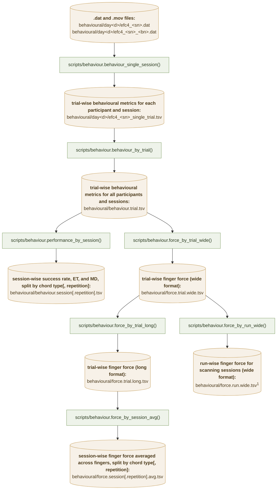
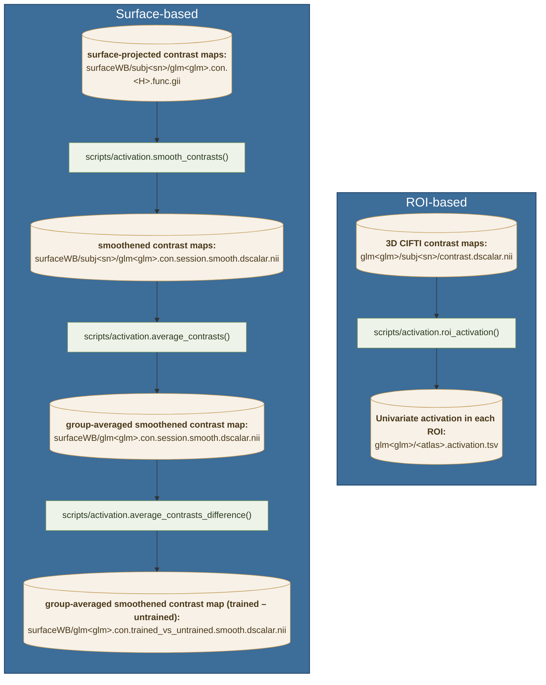
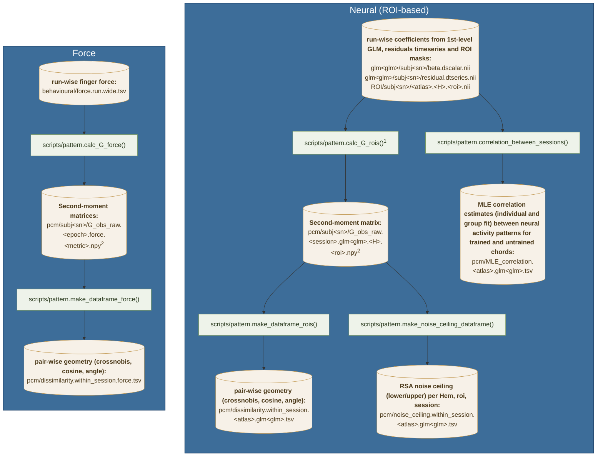

# EFC_learningfMRI

Analysis code for the extension–flexion chord (EFC) learning fMRI study: participants
practise a set of finger chords over 24 days, with fMRI scans on days 3, 9 and 23.

## Experimental design

* 8 chords (`gl.chordID`), 4 assigned as **trained** and 4 as **untrained** per
  participant (`participants.tsv`, columns `trained` / `untrained`).
* 24 days (`behavioural/day1` … `behavioural/day24`); each day is associated to a `session_type`:
  `pretraining` (days 1-2), `scanning` (days 3, 9, 23), `testing` (days 4, 10, 24) or `training` (all other sessions).
* Each trial the participant produces one 4-finger chord; force is sampled at
  500 Hz (`gl.fsample['force']`) and each chord is repeated twice in a row
  (`Repetition` 1 vs 2).

## Dataflows
### Behaviour

1Used for pattern analysis (see below)

<!-- Green = code, amber = saved tables; each green node is the function that writes the tables it
points to. Every step reloads its input from disk, so the arrows are also the order the steps
have to be run in. All paths are relative to `gl.baseDir`; `<sn>` is the participant number,
`<bl>` the block number and `<d>` the day. `<...>` is a placeholder to fill in; `[...]` marks a
part of the name that is only present sometimes (e.g. `[.<repetition>]` is dropped when the G is
not split by repetition). -->

### Univariate activation

<!-- Starting from the per-participant `contrast.dscalar.nii` (written by
`scripts/cifti.CiftiCortex.contrast()`), `scripts/activation.py` produces the ROI-averaged
activation table and the group surface maps. -->

<!-- The ROI step (`roi`) reads `contrast.dscalar.nii` directly. The surface steps (`smooth`,
`average.smooth.surface`) read the per-hemisphere `glm<glm>.con.<H>.func.gii` giftis; those are
the same contrast maps projected onto the surface by `surface.project_cifti_to_surface()`, run
*upstream* of `activation.py` (dashed arrow) — note it keys off the `con` filename stem while the
ROI branch reads `contrast.dscalar.nii`. -->

### Pattern

<!-- `scripts/pattern.py` estimates the second-moment matrices (Gs) of the neural and force
patterns, then summarises their geometry. The neural branch reads the glm betas/residuals (written
by `scripts/cifti.py`) prewhitened within each ROI; the force branch reads `force.run.wide.tsv`
(written by `scripts/behaviour.py`). The dataframe/noise-ceiling/correlation steps reload the
`G_obs_raw` Gs (or the betas, for `correlation`) from disk, so the arrows are also the run order. -->

1`calc_G_rois` performs multivariate prewhitening before calculating the G matrix.

2`calc_G_rois` and `calc_G_force` save `G_obs_raw.*.npy` (cross-validated G matrix, run mean across conditions not removed) and also `G_obs.*.npy` (cross-validated G matrix, run mean across conditions removed), `cov.*.npy` (cross-validated covariance matrix, run mean across conditions removed, voxel-centred), `G_obs_noxal.*.npy` (non-cross-validated G matrix):

<!-- `dataframe_rois` and `noise_ceiling` read only the `G_obs_raw.within_session.*` Gs; `correlation`
reads the betas/residuals directly (not the saved Gs). `<epoch>` is `within_session.<sess>` or
`across_session`, with an optional `[.<repetition>]`; `<spair>` is a session pair like `3-9`. -->

