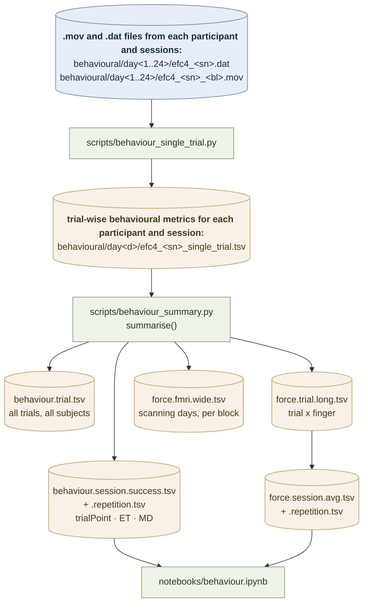

# EFC_learningfMRI

Analysis code for the extension–flexion chord (EFC) learning fMRI study: participants
practise a set of finger chords over 24 days, with fMRI scans interleaved on days 3, 9
and 23.

This README is being rebuilt one branch at a time. The **behavioural** pipeline is
documented below; the imaging pipeline (GLMs → ROI/searchlight multivariate geometry,
PCM) is still to be written up.

## Experimental design

* 8 chords (`gl.chordID`), 4 assigned as **trained** and 4 as **untrained** per
  participant (`participants.tsv`, columns `trained` / `untrained`, drawn by
  `assign_trained.py`).
* 24 days (`behavioural/day1` … `behavioural/day24`), grouped into weeks; each day is
  either a `training` or a `scanning` session (`session_type`). Scanning days are
  `gl.sessions = [3, 9, 23]`.
* Each trial the participant produces one chord with five fingers; force is sampled at
  500 Hz (`gl.fsample['force']`) and each chord is repeated twice in a row
  (`Repetition` 1 vs 2).

## Behavioural data flow



Blue = raw inputs, green = code, amber = saved tables, purple = figures / downstream
consumers. All paths are relative to `gl.baseDir`; the summary tables live directly in
`behavioural/` (`gl.behavDir`).

### 1. Raw task output

`makeTGT.py` builds the per-run `.tgt` files (trained chords only on training days, all
8 chords on scanning days) from `target/template.tgt` and the participant's trained set.
Running the task writes, per day and participant:

* `efc4_<sn>.dat` — one row per trial (`BN`, `TN`, `chordID`, `RT`, `day`, `session`,
  `week`).
* `efc4_<sn>_<bl>.mov` — the force traces of one block, 500 Hz, five differential
  channels (`gl.diffCols`) scaled by `gl.fGain`.

### 2. Single-trial metrics — `scripts/behaviour_single_trial.py`

`force.single_trial_behaviour(sn, session)` pairs each `.mov` block with its `.dat` rows,
keeps the execution phase of the trace (`state == gl.wait_exec`), and computes per trial:

* `trialPoint` — 1 if all required fingers held the target force (`gl.ftarget`) for
  600 ms, 0 otherwise (i.e. the success flag).
* `ET` — execution time up to that sustained crossing; `RT` from the `.dat` file.
* `MD` — mean deviation of the force trajectory from the straight line between start and
  end point (`force.calc_md`).
* `Repetition` — 1 or 2, depending on whether the previous trial had the same `chordID`.
* `chord` — `trained` / `untrained`, from `participants.tsv`.
* per finger: mean signed force, mean absolute force, mean and peak force derivative, and
  time to peak derivative.

Output: `behavioural/day<d>/efc4_<sn>_single_trial.tsv`. Set `sn` and `sessions` at the
top of the script and run it once per participant.

### 3. Summary tables — `scripts/behaviour_summary.py`

Concatenates the single-trial files of all `gl.participants` across all 24 days and
writes the seven tables listed in that script's module docstring. Averages are taken over
**successful trials only**, except `trialPoint`, which is averaged over all trials and is
therefore the success rate — hence the `.success.` in the file names.

```bash
python scripts/behaviour_summary.py
```

### 4. Figures — `notebooks/behaviour.ipynb`

Reads the session-level tables and plots learning curves (success rate, ET, MD, absolute
force, mean and peak force derivative), each split by trained vs untrained and, in the
`rep_*` figures, by repetition. `vis.plot_example_trial` additionally reads the raw
`.mov` files to show example force traces from day 1 vs day 24. Figures are written to
`gl.figDir` (`figures/`).

### Known mismatches

* `notebooks/behaviour.ipynb` reads `force.session.success.tsv` /
  `force.session.success.repetition.tsv`, but `behaviour_summary.py` now writes
  `force.session.avg.tsv` / `force.session.avg.repetition.tsv`. Same for
  `notebooks/intercept_activation.ipynb` and `notebooks/intercept_separation.ipynb`.
* `main.py --what behaviour` calls `force.calc_behaviour`, which no longer exists; use
  `scripts/behaviour_single_trial.py` instead.

## Imaging pipeline

*To be documented.*

## Results overview

* Name of notebook: type of analysis…
