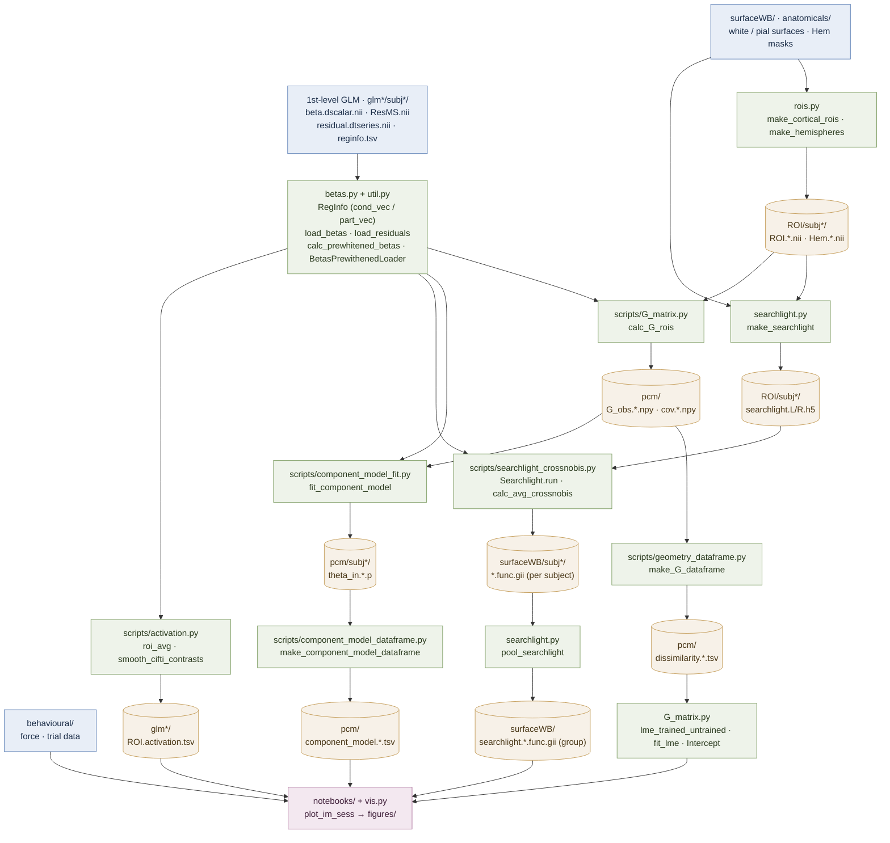

# EFC_learningfMRI

Analysis code for the extension–flexion chord (EFC) learning fMRI study: from 1st-level
GLM betas to ROI / searchlight multivariate geometry, PCM component models, and statistics.

## Pipeline overview

Legend: blue = external inputs, green = code (module / entry-point script), amber = saved
data artifacts, purple = final figures. Paths are relative to `gl.baseDir`; `*` stands in
for the subject / hemisphere / ROI / session / glm fields (e.g. `subj101`, `L`, `M1`, `glm3`).

Two multivariate branches share the prewhitened betas: an **ROI** branch (`G_obs` →
crossnobis/cosine dissimilarities and PCM component weights) and a **surface searchlight**
branch (per-subject `func.gii` maps pooled into group maps).

